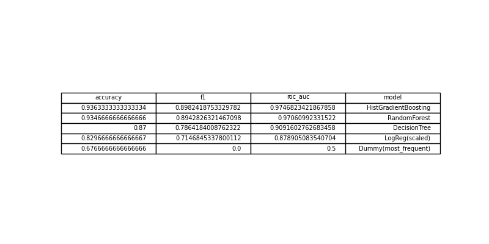

# HW06 – Report

> Файл: `homeworks/HW06/report.md`  
> Важно: не меняйте названия разделов (заголовков). Заполняйте текстом и/или вставляйте результаты.

## 1. Dataset

- Какой датасет выбран: `S06-hw-dataset-01.csv`
- Размер: 12000 строк; 30 столбцов
- Целевая переменная: `target` - бинарный классификация: 0 - 67%, 1 - 33%
- Признаки: float64 (num01 - num24), int64 (остальные признаки)

## 2. Protocol

- Разбиение: train/test (75%/25%, `random_state` = 42)
- Подбор:  Кросс-валидация на тренировочной выборке с использованием StratifiedKFold (5 фолдов). Стратификация сохраняет распределение классов в каждом фолде, что критично для несбалансированных данных.
- Метрики: accuracy, F1, ROC-AUC. Выбор метрик обусловлен тем, что целевая переменная несбалансирована (67%/33%), и нужны показатели, устойчивые к этому.

## 3. Models

- DummyClassifier(strategy='most_frequent'): Baseline, всегда предсказывает самый частый класс. Позволяет оценить, дает ли "умная" модель реальный выигрыш.

- LogisticRegression(max_iter=5000, random_state=42): Линейная базовая модель. Используется для сравнения с более сложными алгоритмами.

- DecisionTreeClassifier(random_state=42): Подбираемые гиперпараметры: max_depth и min_samples_leaf. Эти параметры контролируют сложность и борются с переобучением.

- RandomForestClassifier(random_state=42, n_jobs=-1): Подбираемые гиперпараметры: n_estimators, max_depth, min_samples_leaf. Ансамбль деревьев, устойчивый к переобучению.

- HistGradientBoostingClassifier(random_state=42): Подбираемые гиперпараметры: max_iter, max_depth, learning_rate. Мощный градиентный бустинг на гистограммах, часто показывает наилучшее качество.

## 4. Results

- Таблица/список финальных метрик на test по всем моделям

- Победитель по всем критериям стала модель HistGradientBoosting. (Краткое описание)

## 5. Analysis

- Устойчивость: при изменении `random_state` на модели HistGradientBoosting было устоновленно, что значения метрик качества меняются в порядке тысячных.
- Ошибки: confusion matrix для лучшей модели + комментарий
 

- Интерпретация: permutation importance (top-10/15) + выводы
 

## 6. Conclusion

- Протокол — это основа. Фиксированный random_state, стратификация при CV и использование отдельной тестовой выборки — обязательные условия для получения воспроизводимых, надежных и честных результатов сравнения моделей.

- Ансамбли эффективны. Случайный лес и особенно градиентный бустинг (HistGradientBoosting) значительно превосходят по качеству одно дерево и линейные модели на данном наборе данных, демонстрируя силу комбинирования множества слабых моделей.

- Контроль сложности важен. Даже простая настройка max_depth и min_samples_leaf позволила Decision Tree избежать серьезного переобучения и показать достойный результат.